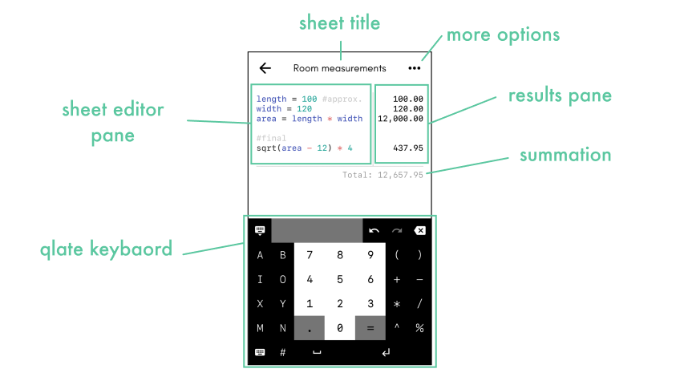
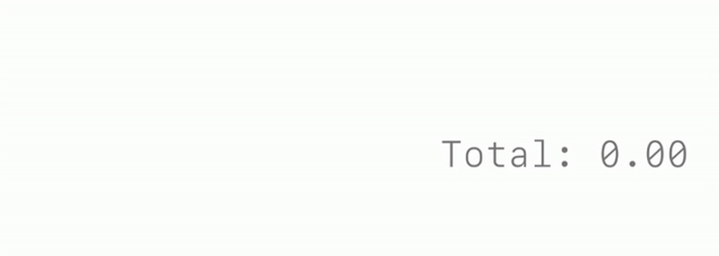
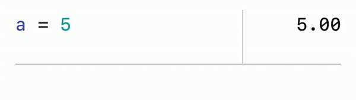
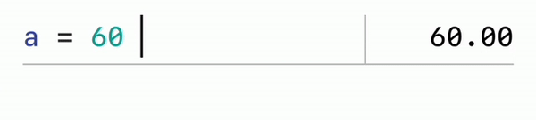
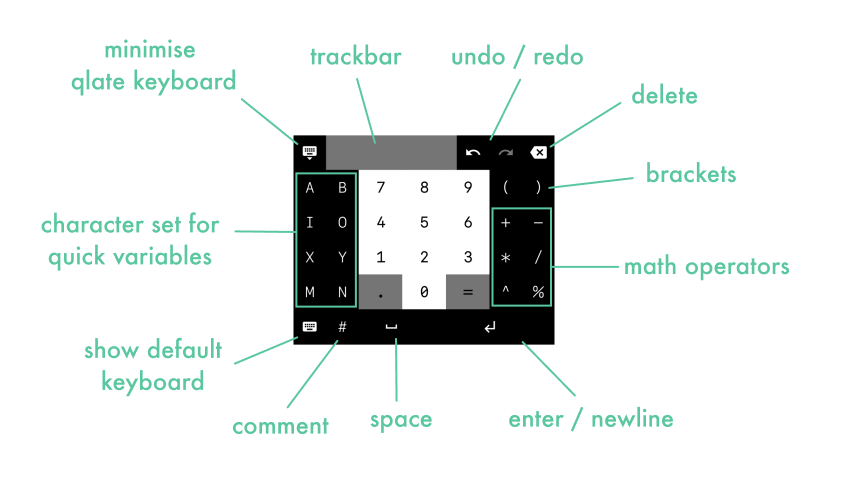

# Qlate Help

## What is Qlate?

Qlate combines notetaking and calculations into one app. Using Sheets you can do quick math calculations or evaluate complex variable based expressions. Qlate evaluates them and displays the results instantaneously as you type.

## How to Use it?

### Layout

Sheet Editor Pane is where you type your calculations and notes. Results will auto show and update in the Results Pane as you type on. Tapping title will let you edit sheet's details like - title, description and tag colors.
 You can disable summation text from 'more' options.

**Note: Your sheet updates are auto saved when you press back**

### Simple calculations

simply type a math calculation as you would type in any other calculator. Qlate will will auto evaluate it without the need to press '='

### Using variables

type a word and assign a number to it using '='. Please note that it has to be **one word without any space** in it.

### Using expressions

You can combine simple numerical operations and variables to do complex and dynamic calculations.

**Note: Qlate follows [BODMAS](https://en.wikipedia.org/wiki/Order_of_operations) order of operations to evaluate the expressions.**

### Using comments

Anything you type after '#' is ignored by Qlate during evaluations. You can use comments as note for your calculations.

## What is Qlate keyboard?

Qlate keyboard is a specially designed keyboard for quick variable based calucations. You can easily access the default keyboard if required (for longer variable names for e.g.).

## What is Notepad Mode?

In Notepad mode, Qlate will not do any text processing, calculations or highlighting. Evaluation pane Qlate Keyboard will also be disabled. Qlate will behave like a notepad

---

## Operators

Qlate supports following math operators

| Operator | Description                       | Example      |
| :--------- | :---------------------------------- | :------------- |
| `+`      | Addition                          | `1 + 1 = 2`  |
| `-`      | Subtraction                       | `2 - 1 = 1`  |
| `*`      | Multiplication                    | `2 * 4 = 8`  |
| `/`      | Division                          | `10 / 2 = 5` |
| `%`      | Remainder of a division           | `5 % 2 = 1`  |
| `^`      | Exponential                       | `2 ^ 4 = 16` |
| `+/-`    | Unary Minus,Plus (Sign Operators) | `+2 - (-2)`  |

## Functions

Qlate supports following math functions

* abs: absolute value
* acos: arc cosine
* asin: arc sine
* atan: arc tangent
* cbrt: cubic root
* ceil: nearest upper integer
* cos: cosine
* cosh: hyperbolic cosine
* exp: euler's number raised to the power (e^x)
* floor: nearest lower integer
* log: logarithmus naturalis (base e)
* log2: logarithm to base 2
* log10: logarithm to base 10
* sin: sine
* sinh: hyperbolic sine
* sqrt: square root
* tan: tangent
* tanh: hyperbolic tangent
* signum: signum of a value

**Examples:** 
`abs(-10) = 10` 
`sqrt(4) = 2`

**Note: These function words are reserved and cannot be used as variable names**

For e.g. In `sqrt = 10`, value `10` **will not** be saved in `sqrt`.

## Numerical Constants

By default Qlate has numerical constants set. However, these can be overridden by the user.

| Constants | Value |
| :---------- | :------ |
| `pi`      | 3.14  |
| `e`       | 2.71  |

---

## Sheets Management

### Deleting Sheets

When you delete a Sheet, it is moved to Trash. You can find them in `Settings > Trash`. From the Trash you can restore or permanently delete the Sheets.

### Backup

From `Settings > Backup` you can save all your sheets in a `.Qlate` file on to your file system.

### Import / Restore

(Only available in Paid version)

From `Settings > Import` you can load Sheets from a `.Qlate` file on the app. This will keep the existing Sheets on the app. Hence there is chance of duplication of the Sheets.

From `Settings > Restore` you can restore Sheets from a `.Qlate` file on the app. This will **delete** all the existing Sheets on the app.

## Ads

Free version of Qlate is supported by Ads. User can temporarily disable all Ads from the app by watching an Ad in `Settings > Remove Ads` option.

## Contact

Please feel free to reach to me at pranaykarani@gmail.com for any suggestion, feedback, query, help or support.

# Enjoy!
